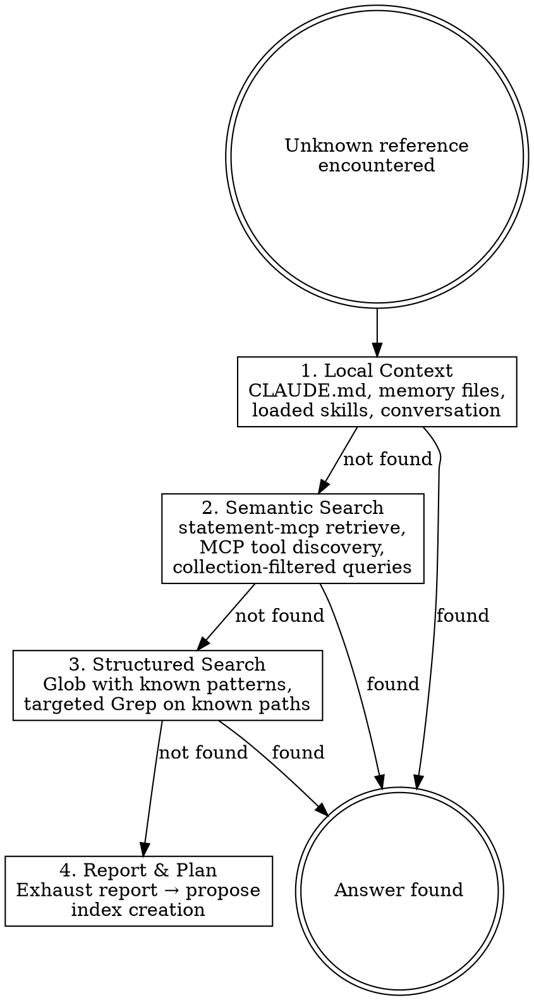

# Context-First Lookup

## Overview

**Never produce junk output hunting for information.** When you encounter something unknown, follow the lookup hierarchy: local context first, then semantic search, then — only as a last resort — targeted file search. If everything fails, propose creating an index so the question never requires exploration again.

**Core principle:** Every lookup should either find the answer immediately or improve the system so the next lookup will. In practice, speculative greps return irrelevant results ~80% of the time and burn 1-2K context tokens per attempt with no lasting benefit.

## When to Use

- You don't know where something is defined or what it refers to
- You're about to grep, cat, ls, or read files speculatively
- You encounter an unfamiliar term, reference, or concept in the codebase
- An error message references something you can't immediately locate

## When NOT to Use

- You already know the exact file path — just read it
- The user explicitly says "grep for X" or "search the codebase for X"
- You're reading a file the user just pointed you to
- You're running a build, test, or other execution command — not an information lookup

## Lookup Hierarchy



## Level 1: Local Context

Check what's already loaded or immediately available:

| Source                       | How to check                                                |
| ---------------------------- | ----------------------------------------------------------- |
| CLAUDE.md (global + project) | Already in context — re-read it                             |
| Memory files                 | Read MEMORY.md index, then relevant files                   |
| Loaded skills                | Already in context — re-read them                           |
| Conversation history         | Scroll up / recall from current session                     |
| Plan files                   | Check `docs/plans/` if a plan is active                     |
| Recent chat history          | See below — use when you don't even know what to search for |

**No tool calls needed** for the first five sources — they're a mental check of what you already have.

**If you don't know what context to look for** — e.g., the user references something from a prior session with no keywords, or you're picking up work mid-stream — read recent chat history for this project and session:

```
mcp__statement-mcp__retrieve
  query: "recent work"
  project: "current-project"
  content_type: "chat"
  sort: "chronological"
  limit: 20
```

Search by both project and session to find the right thread of work — there may be multiple sessions active in the same directory. This gives you the search terms and context needed to drive the rest of the hierarchy. Don't skip this step and jump straight to semantic search with a vague query — you'll get noise.

## Level 2: Semantic Search

Use tools designed for knowledge retrieval. Start broad, then narrow:

**Broad semantic query:**
```
mcp__statement-mcp__retrieve
  query: "the thing you're looking for"
  project: "current-project"        # if known
  mode: "semantic"                  # default hybrid search
```

**Collection-filtered query** (when you know the content domain):
```
mcp__statement-mcp__retrieve
  query: "your search"
  content_type: "document"
  tags: { "collection": "project-name" }
```

**Discovery:**
- `mcp__statement-mcp__status` — see what's indexed for this project
- `mcp__memory__search_nodes` — knowledge graph entries
- Other MCP tools that might have relevant data

**Key:** Semantic search finds conceptually related content even with different wording. Always try 2-3 query phrasings before concluding nothing exists.

If the project should have a collection but doesn't, **stop and ingest it first:**

```
mcp__statement-mcp__ingest_collection
  path: "/absolute/path/to/project"
  collection: "project-name"
  glob_pattern: "**/*.md"    # or appropriate pattern
```

Then search the newly created index. This is not wasted time — it permanently solves the lookup problem.

## Level 3: Structured Search (Last Resort)

Only reach this level after exhausting 1-2. When you do:

- **Glob** for specific file patterns you expect to exist (not `**/*`)
- **Grep** for exact strings, function names, or error messages
- **Read** specific files you have reason to believe contain the answer

**Rules:**
- Never `ls` a directory to "see what's there"
- Never `grep -r` across an entire codebase speculatively
- Never `cat` a file to "take a look"
- Every search must have a specific hypothesis: "I believe X is defined in files matching Y"

## Level 4: Report & Plan

If all levels fail, **do not keep fishing.** Instead:

1. **Report** what you tried at each level and why it didn't work
2. **Propose** an index creation plan so this lookup succeeds next time:
   - What content should be ingested?
   - What collection name and glob pattern?
   - What tags should be added?
   - Should a memory file be created?
3. **Ask** the user whether to create the index now or proceed differently

This turns every failed lookup into a system improvement.

## Red Flags — STOP and Use the Hierarchy

| Thought                                | Reality                                                                   |
| -------------------------------------- | ------------------------------------------------------------------------- |
| "Let me just quickly grep for it"      | Grep produces junk. Check indexes first.                                  |
| "I'll cat a few files to see"          | Reading random files is not a strategy. Check context.                    |
| "Let me ls the directory"              | You don't need a listing. You need the answer. Use semantic search.       |
| "I'll search the codebase"             | Search the INDEX. The codebase is not a search engine.                    |
| "Let me explore a bit"                 | Exploration without structure wastes context. Follow the hierarchy.       |
| "This will be faster than the index"   | It won't. And it won't help next time either.                             |
| "The index probably doesn't have this" | Check. Don't assume. `status` takes 1 second.                             |
| "I know roughly where this is"         | If you know exactly, go there. If roughly, use semantic search.           |
| "Let me search the web for this"       | Web search is for external knowledge. Internal references are in indexes. |

## Common Mistakes

| Mistake                                       | Fix                                                                      |
| --------------------------------------------- | ------------------------------------------------------------------------ |
| Grepping before checking statement-mcp        | Always `retrieve` first, even if you think grep would be faster          |
| Using `grep -r . -l` across entire repo       | Use Glob with specific pattern or semantic search                        |
| Reading 10 files "to understand the codebase" | Read the index, the CLAUDE.md, the memory. Then read specific files.     |
| Not trying multiple query phrasings           | Semantic search is fuzzy — rephrase 2-3 times before giving up           |
| Skipping Level 4 when stuck                   | Every failed lookup should create an index. Don't just move on.          |
| Ingesting but not adding tags                 | Always add appropriate tags (project, topic, collection) after ingesting |

## Forbidden Responses

**"I don't have context" is never an acceptable answer.** Neither are variants:

- "I don't have enough information to..."
- "The context was compacted so I can't see..."
- "I'm not sure what this refers to" (without having tried the hierarchy)
- "I can't find that" (without exhausting all levels)
- "I don't have access to..." (when tools exist to get it)

If you're tempted to say any of these, you haven't finished the hierarchy. Go back to Level 1.

## The Bottom Line

**Grep is not a knowledge system. Indexes are.**

Every time you grep instead of querying an index, you:
1. Produce noisy output that wastes context
2. Get results without semantic understanding
3. Leave the system no better for next time
4. Train yourself (and the user) to accept slow, unreliable lookups

Follow the hierarchy. Build indexes. Make every lookup improve the system.
